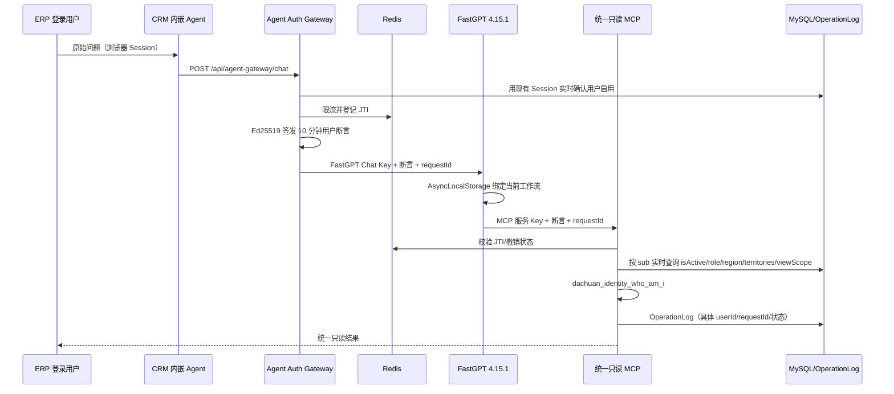

# CRM 内嵌 Agent 可信身份桥接 PoC

## 本阶段边界

本阶段只交付“登录用户到 `who_am_i`”的最小闭环。默认 `MCP_TOOL_MODE=IDENTITY_POC`，MCP 只注册 `dachuan_identity_who_am_i`；既有 21 个只读业务工具不会在 PoC 模式暴露。Tavily Search Policy Gateway 和 21 个工具的完整权限矩阵留到 PoC 验收后实施。

没有 Prisma schema 或 migration 变更，不连接生产数据库，不部署服务器。

## 身份传递链



浏览器和模型都不会获得用户断言。Gateway 不转发浏览器 Cookie、Authorization 或自报的用户字段；FastGPT 补丁只从 HTTP 请求头进入请求级上下文，不从模型变量、提示词或工具参数读取身份。

## 严格鉴权

MCP 正式模式每次请求必须同时具备：

```text
Authorization: Bearer <FastGPT 服务 Key>
X-Dachuan-User-Assertion: <Ed25519 短期用户令牌>
X-Dachuan-Request-Id: <8～128 位 requestId>
```

缺少或无效的任一项都会在执行工具前拒绝。`MCP_LEGACY_USER_BOUND_AUTH` 默认关闭；即使服务 Key 配置中残留 `userId`，也不能绕过用户断言。仅隔离测试可显式设置 `MCP_LEGACY_USER_BOUND_AUTH=true`，生产禁止开启。

断言算法固定为 EdDSA/Ed25519，包含 `kid`、`iss`、`sub`、`aud`、`iat`、`nbf`、`exp`、`jti`。只信任 `sub` 作为候选 User.id；角色和范围不写入令牌。默认有效期 600 秒，配置只允许 300～900 秒。

Redis 保存 JTI 有效/撤销状态和限流窗口，键中只出现输入值的 SHA-256，不保存原始 JTI 或用户 ID。Redis 不可用时 Gateway/MCP 失败关闭。

## FastGPT 4.15.1 结论

已检查 FastGPT `v4.15.1` 对应源码提交 `a0aec83f2ae444f5783416d17d0d9d12b7c1dc39`。现有服务端插件调用只支持固定插件 Token 和普通 `systemVar/input`，MCP 配置也只有固定请求头，无法安全动态注入逐用户断言；把断言放入变量或提示词会违反身份边界。因此采用独立最小补丁：

- 只改 5 个 FastGPT 文件；
- 复用 FastGPT 已有 `AsyncLocalStorage`，不新增全局身份变量；
- 将两个可信头绑定当前工作流，并在 Streamable HTTP/SSE MCP 出站时删除所有静态 `X-Dachuan-*` 头后注入当前请求值；
- 包含两用户并发隔离测试；
- 应用脚本校验精确提交，可预检、自动应用和反向回滚。

补丁位于 `deploy/fastgpt/v4.15.1/`。自定义镜像必须固定为 `dachuan-fastgpt:v4.15.1-identity-poc.1`，不得使用 `latest`。

FastGPT 管理界面的 `/api/core/app/mcpTools/getTools` 不在聊天工作流上下文中，没有可信用户断言；生产严格模式会按设计拒绝该接口直接刷新工具列表。PoC 工具定义应在隔离非生产环境显式开启兼容模式完成发现后导入，或使用已审查的应用配置，随后恢复 strict 配置再构建生产镜像。生产不得为管理界面开启 legacy。下一阶段必须验证工具配置导入与运行时动态调用两条路径，再开放 21 个业务工具。

## 配置与本地验证

1. 生成服务 Key 哈希：`corepack pnpm mcp:keygen`。
2. 生成 Ed25519 密钥文件：`corepack pnpm agent:keygen -- C:\安全目录\agent-auth-keys.json dachuan-agent-2026-07-a`。脚本拒绝覆盖已有文件，也不会把私钥打印到终端。
3. 根据 `.env.mcp.example` 把密钥内容写入服务端 Secret/环境配置，不提交该 JSON 文件。
4. FastGPT MCP Server 使用固定 `Authorization: Bearer <MCP 服务 Key>`；不要配置用户断言静态值。工具发现按上一段的隔离环境流程完成。
5. CRM 内嵌入口只请求 `/api/agent-gateway/chat`，不要让浏览器直接持有 FastGPT Chat Key。
6. 在隔离数据库和 Redis 中运行 PoC，调用 `dachuan_identity_who_am_i`，核对返回 userId、响应 requestId 与 `OperationLog`。

FastGPT 补丁应用和回滚见 `deploy/fastgpt/v4.15.1/README.md`。自动化证据见 `IDENTITY_POC_TEST_REPORT.md`。

## 密钥轮换

先在 `AGENT_AUTH_KEYS_JSON` 同时配置旧、新公钥及新私钥，将 `AGENT_AUTH_ACTIVE_KID` 切到新 kid 并重启各实例。等待旧令牌最长 15 分钟过期后删除旧私钥；确认无旧 kid 流量后再删除旧公钥。MCP 服务 Key 采用先并存哈希、切换 FastGPT、再删除旧哈希的顺序。
